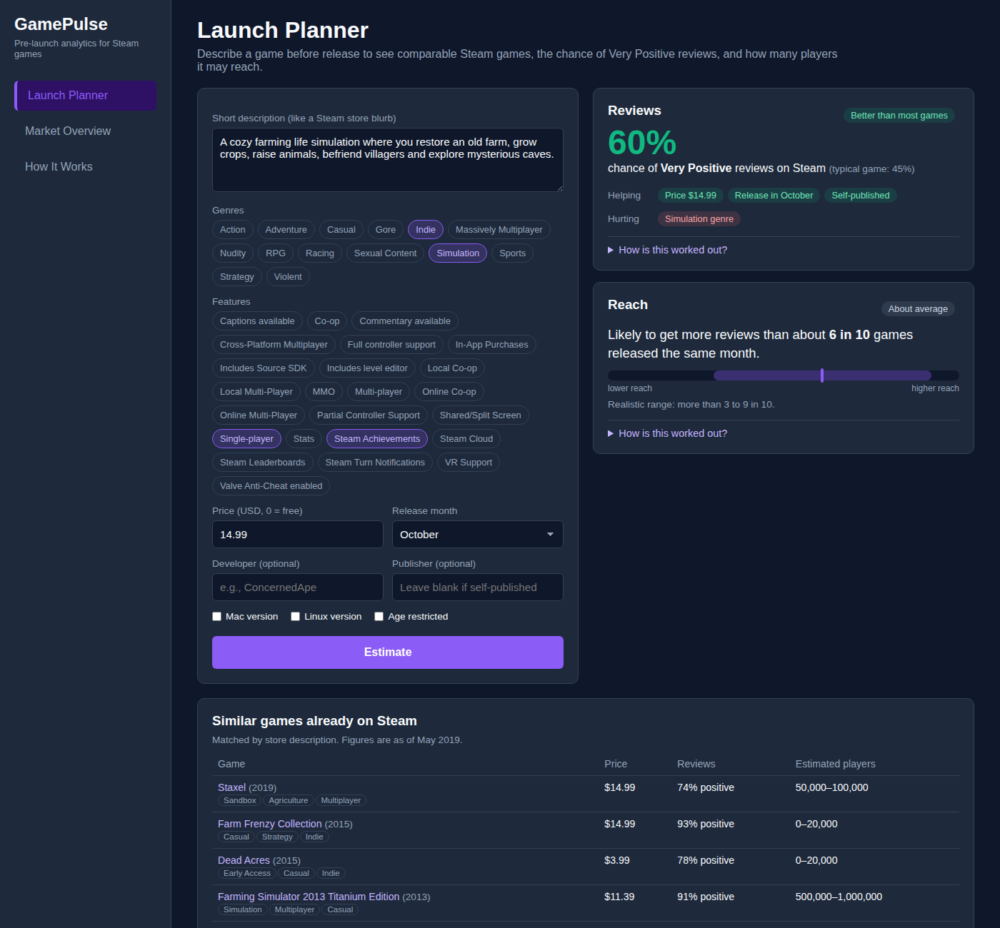
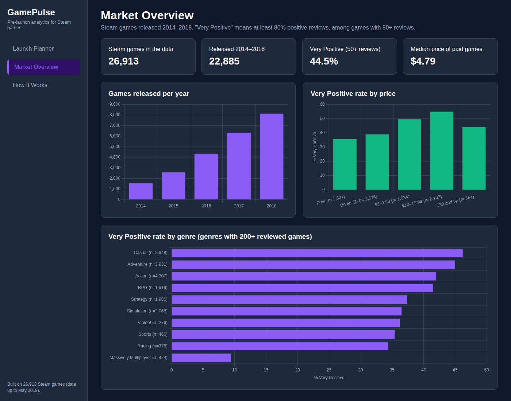

# GamePulse

GamePulse helps a game studio or publisher judge a Steam game **before it is released**. Describe the game, and its **Launch Planner** shows the most comparable existing Steam games, the chance that the game will get Very Positive reviews, and how many players it may reach, with a range for how uncertain that is. Every estimate was tested on games the models had never seen, and the app shows those results next to each estimate.



## Project history

GamePulse went through three versions. The later two came from asking whether the earlier one actually worked.

- **Version 1: course project.** Built by a team of three for a semester-long Software Engineering and Project Management course, using sprints and user stories. It used 1,271 Nintendo Switch games that the team collected from Wikipedia and Switch Scores, and a hand-written rule to score how successful a new game might be. The submitted version is preserved at the tag [`v1-course-submission`](https://github.com/mayanksharma2511/GamePulse/tree/v1-course-submission).
- **Version 2: testing the rule.** After the course, I (Mayank Sharma) tested that rule on games released after the ones it was built from. About a quarter of the dataset's ratings and prices turned out to be filled-in averages, and the rule's scores had no relationship with real ratings (Spearman ρ = −0.05). It was less accurate than always guessing the average. The best learned model improved on that average only modestly, because the data contained little information about how games are received. Details: [`analysis/`](analysis/).
- **Version 3: better data.** I rebuilt GamePulse on 26,913 Steam games with the information that matters before launch (store features, descriptions and each studio's track record), with real outcomes (review scores and review counts) to test against. This is the current app. Details: [`steam_analysis/`](steam_analysis/).

## What the app does

| Page | What it shows |
|---|---|
| **Launch Planner** | For a game described by its store blurb, genres, features, price, platforms, release month, developer and publisher: the chance of Very Positive reviews and what moved that estimate; expected reach with an 80% range; the closest comparable Steam games with their prices, review scores and player estimates |
| **Market Overview** | Steam releases per year, and how the share of Very Positive games varies by price and genre |
| **How It Works** | The methods, their measured accuracy on unseen games, and their limitations |

## Results on games the models had not seen

Models were trained on games released 2014–2017 and tested on 8,120 games released in 2018. Full details: [`steam_analysis/EVALUATION.md`](steam_analysis/EVALUATION.md) and [`steam_analysis/MODELS.md`](steam_analysis/MODELS.md).

**Reception: will a game be Very Positive (80%+ positive reviews)?** (2,003 test games with 50+ reviews; 52.9% were Very Positive)

| Method | AUC | Very Positive among the model's top 20% |
|---|---|---|
| Base rate | 0.500 | — |
| Logistic regression: store info | 0.718 | 75.0% |
| Logistic regression: + developer and publisher track record | 0.742 | 79.2% |
| **Logistic regression: + store description** | **0.752** | **80.5%** |

**Reach: how many reviews will it collect, compared with games released the same month?** (a percentile, 0–100)

| Method | Mean absolute error | Spearman ρ |
|---|---|---|
| Always guess the middle (50th percentile) | 25.00 | — |
| Ridge regression: store info | 20.93 | 0.500 |
| **Gradient boosting: store info + track record** | **19.47** | **0.555** |

Every model is clearly better than its baseline: the 95% bootstrap intervals of the difference exclude zero.

**The models used in the app** were checked the way they are used (fitted on 2014–2016, calibrated on 2017, tested on 2018):

| Check | Result |
|---|---|
| Reception: calibration error before and after recalibration on the latest year | 0.119 → 0.082 |
| Reach: share of games whose real reach fell inside the 80% range | 77.3% (range ± 30.1 percentile points) |
| Comparable games: top-10 matches sharing a genre with the game | 66.6% (48.9% for random games) |

## Keeping the models honest

- **Only pre-launch information is used.** User tags are chosen by players after release, so they are shown for comparable games but never used to predict. Trading cards, Workshop support, SteamVR Collectibles, and the Early Access and Free to Play labels were excluded because they are often added or changed after release.
- **Reach is compared within a release month.** Older games have had longer to collect reviews, so raw counts cannot be compared across release dates.
- **Track records use only a studio's games released at least a year earlier,** so a game's own outcome, or any test game's, is never used as an input.
- **Time-based split.** Models learn from earlier games and are tested on later ones, as they would be used.
- **Measured uncertainty.** Probabilities are recalibrated on the most recent year, and the reach range comes from conformal prediction, with its real coverage reported.

## Limitations

- The data ends in May 2019, so the models describe the Steam market of 2014–2018.
- Review counts are a rough stand-in for sales; the data has no sales figures.
- The share of Very Positive games rose over time, so even after recalibration the probabilities ran slightly low on the newest games (44.8% predicted on average vs 52.9% observed).
- The reach range has the same width for every game and covered 77.3% of test games, slightly below its 80% target.
- Price, platforms and store features are as listed in 2019, which can differ from launch.
- The reception model only covers games that reached 50+ reviews.
- The Launch Planner assumes the game will be available in English, as 98.1% of the games in the data were.

## Reproducing the results

You need Python 3. The Steam data is included (`steam_analysis/data/raw/`).

```bash
pip3 install -r steam_analysis/requirements.txt
python3 steam_analysis/prepare_data.py   # audit and features → DATA_AUDIT.md, data/steam_games.csv
python3 steam_analysis/evaluate.py       # model comparison → EVALUATION.md
python3 steam_analysis/train_models.py   # app models and checks → MODELS.md, ml_engine/steam_models.joblib
```

The version 2 analysis can be reproduced the same way with the scripts in `analysis/` (see its reports).

## Running the app

You need Node.js and Python 3.

```bash
pip3 install -r ml_engine/requirements.txt
cd backend
npm install
node server.js        # runs on http://localhost:3000
```

Then open `frontend/index.html` in a browser.



## Architecture

```
Browser (HTML, CSS, JavaScript, Chart.js)
        │  fetch()
        ▼
Node.js / Express API (port 3000)
        │  runs ml_engine/launch_planner.py with execFile, returns JSON
        ▼
Python (pandas, scikit-learn) ──► ml_engine/steam_models.joblib (built by steam_analysis/train_models.py)
                              └─► steam_analysis/data/steam_games.csv
```

| Endpoint | Method | What it returns |
|---|---|---|
| `/api/options` | GET | Form options and the models' measured accuracy |
| `/api/estimate` | POST | Estimates and comparable games for one game |
| `/api/market` | GET | Market statistics |

## Repository structure

```
steam_analysis/   version 3: Steam data, audit, evaluation and model training
analysis/         version 2: audit and evaluation of the original dataset and rule
ml_engine/        the Launch Planner script and trained models used by the API
backend/          Express API
frontend/         the web app
docs/             screenshots
```

## Data and credits

Steam data: ["Steam Store Games (Clean dataset)"](https://www.kaggle.com/datasets/nikdavis/steam-store-games) by Nik Davis, collected from the Steam store and SteamSpy, licensed under [CC BY 4.0](https://creativecommons.org/licenses/by/4.0/). Only the store ID and short description were kept from its description file.

Version 1 data (`analysis/finalData.csv`): 1,271 Nintendo Switch games. The team scraped game titles from Wikipedia's *List of Nintendo Switch games* pages ([0–9 and A](https://en.wikipedia.org/wiki/List_of_Nintendo_Switch_games_%280%E2%80%939_and_A%29), [B](https://en.wikipedia.org/wiki/List_of_Nintendo_Switch_games_%28B%29), [C–G](https://en.wikipedia.org/wiki/List_of_Nintendo_Switch_games_%28C%E2%80%93G%29), [H–P](https://en.wikipedia.org/wiki/List_of_Nintendo_Switch_games_%28H%E2%80%93P%29), [Q–Z](https://en.wikipedia.org/wiki/List_of_Nintendo_Switch_games_%28Q%E2%80%93Z%29)), each game's plot from its Wikipedia article, and further game data from [Switch Scores](https://www.switchscores.com/games/by-title). Wikipedia text is licensed under [CC BY-SA 4.0](https://creativecommons.org/licenses/by-sa/4.0/).

Tech: Python (pandas, NumPy, SciPy, scikit-learn), Node.js, Express, JavaScript, Chart.js.
